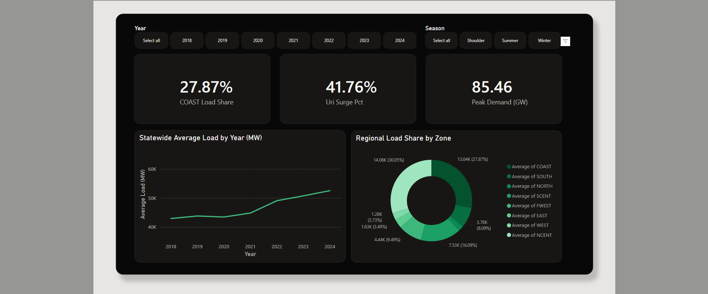
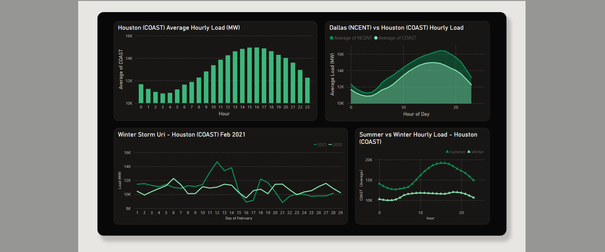
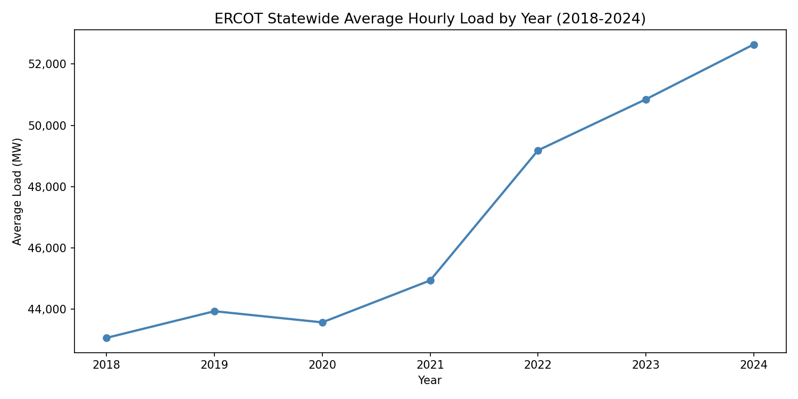
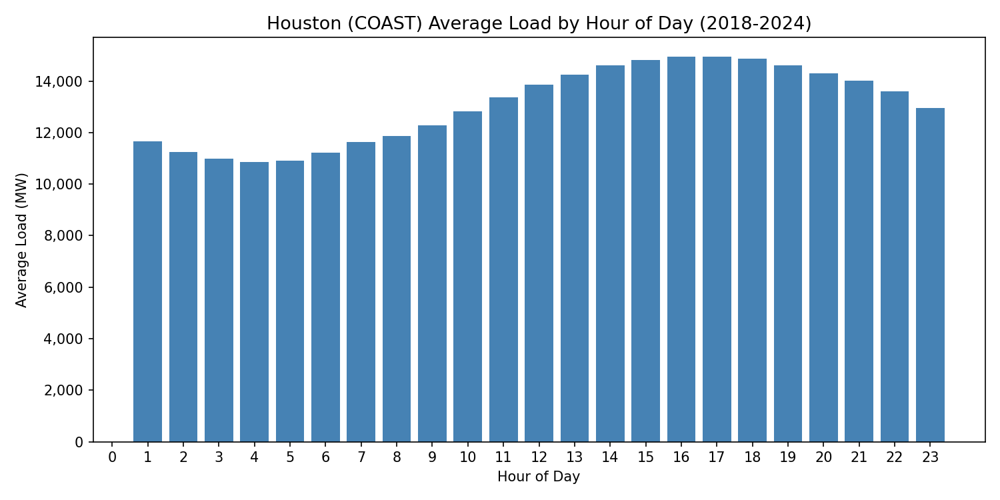
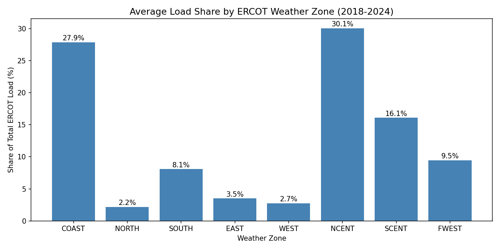
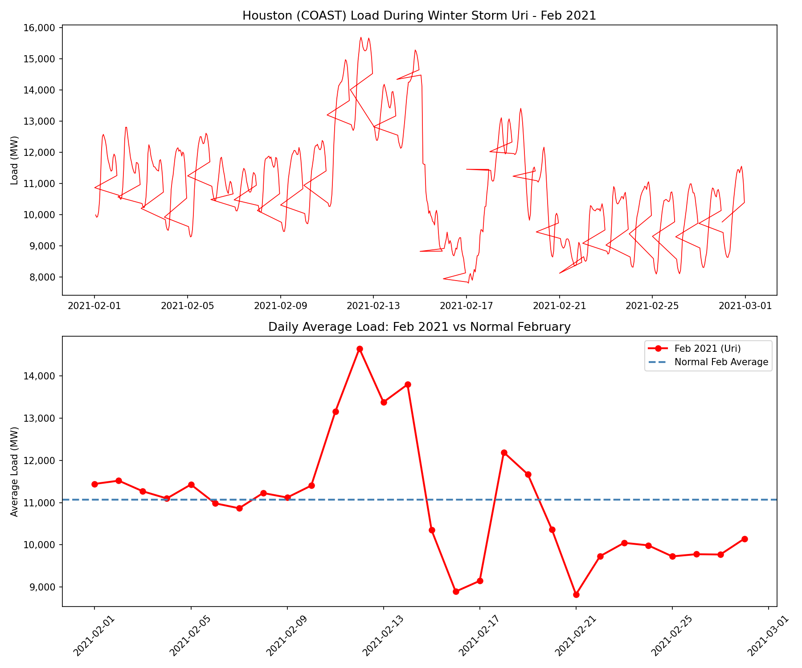
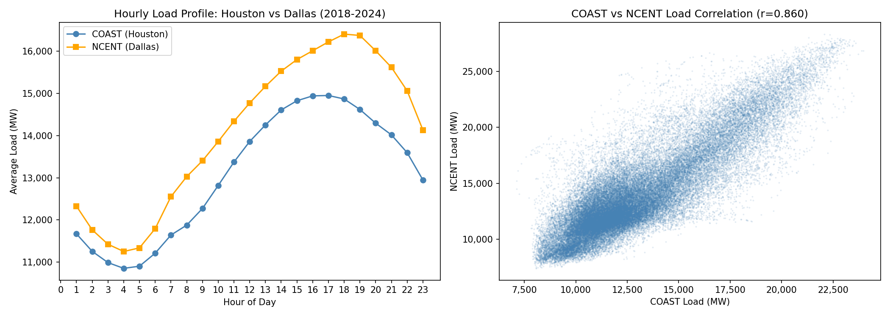
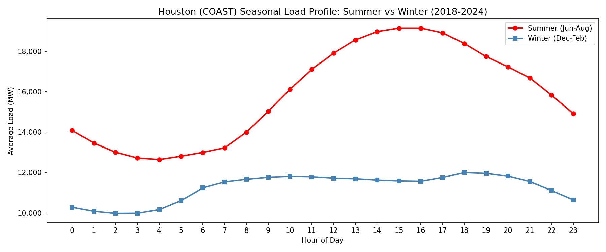

# ERCOT Texas Grid Load Analysis (2018-2024)

Analysis of **61,000+ hourly electricity load records** across **8 ERCOT weather zones** over 7 years, uncovering long-term demand trends, seasonal patterns, regional correlations, and grid vulnerabilities under extreme weather.

---

## Business Context

The Texas grid (ERCOT) is one of the largest and most stressed in the United States. Between accelerating data center construction, Winter Storm Uri (Feb 2021), and the summer-dominated load profile of the Gulf Coast, the grid faces simultaneous pressure on capacity planning, risk management, and dispatch coordination.

This project translates 7 years of public ERCOT operational data into six quantitative findings that directly inform three business decisions:

- **Capacity procurement** — how much generation to contract for, and when
- **Dispatch strategy** — when and where the grid will be most stressed
- **Risk management** — how to size reserves against extreme-weather scenarios

---

## Data

- **Source:** [ERCOT Hourly Load Data Archives](https://www.ercot.com/gridinfo/load/load_hist)
- **Scope:** 2018-2024, 8 Weather Zones (COAST, NORTH, SOUTH, EAST, WEST, NCENT, SCENT, FWEST) plus statewide ERCOT total
- **Volume:** 61,000+ hourly records
- **Format:** 7 annual Excel files (one per year)

---

## Methodology

1. **Schema normalization** — Column naming convention changed across years (`HourEnding` in 2018-2020 vs `Hour Ending` with a space in 2021-2024); normalized before concatenation.
2. **Time-series feature engineering** — Parsed timestamps and derived year, month, hour fields for grouping.
3. **Six analytical views** — Yearly growth, hourly profile, regional share, extreme-weather impact, inter-zonal correlation, seasonal comparison.
4. **Visualization** — matplotlib charts saved as PNGs under `outputs/` for reporting.

---

## Interactive Dashboard

### Overview (Preview)



### Deep Dive (Preview)



For full interactivity and detailed views, explore the [live dashboard](https://app.powerbi.com/view?r=eyJrIjoiNWRmNGI2ODktODMwMS00ZGUwLWFhMWEtNDI3NzZhNTRhMzJkIiwidCI6IjQ5MDgyZTYzLWM4NzEtNGMwZS1hNmNiLWRmODBmNTVmOGIyNSJ9).

---

## Key Findings

### 1. Post-2022 Demand Growth Acceleration

Statewide ERCOT demand grew **22.3%** from 2018 to 2024. Post-2022 annual growth averaged **5.47%**, roughly **3.8x** the pre-2022 baseline of **1.45%**. This structural shift aligns with the wave of large-scale data center openings in Texas (Meta/Fort Worth 2022, Amazon/Dallas 2022, Microsoft 2023, xAI 2024).

> **Strategic implication:** Post-2022 growth should be modeled as the new demand baseline for long-term capacity planning.



### 2. Houston Daily Load Profile

Houston (COAST) load peaks at **16:00** (14,951 MW) and bottoms at **3:00 AM** (10,854 MW) — a **37.7% peak-to-trough swing**.

> **Strategic implication:** Defines the daily peaker-plant dispatch window and the scale of demand-response flexibility needed.



### 3. Regional Load Concentration

NCENT (Dallas-Fort Worth) and COAST (Houston) together account for nearly 58% of statewide load (30.0% and 27.9% respectively).

> **Strategic implication:** Reliability investment and grid-hardening priorities should concentrate on these two zones.



### 4. Winter Storm Uri — Empirical Risk Benchmark

During Feb 2021, Houston demand surged **41.8% above the normal February baseline** (15,692 MW peak vs. 11,070 MW normal), then **collapsed to 7,804 MW** as the grid failed.

> **Strategic implication:** Quantitative benchmark for sizing winter reserve margins and evaluating weatherization ROI.



### 5. Houston-Dallas Peak Synchronization

The two largest zones are highly correlated (**r = 0.859**) with peaks just **one hour apart** (16:00 Houston, 17:00 Dallas).

> **Strategic implication:** Grid stress compounds during a narrow 16:00-17:00 window statewide, a structural constraint on dispatch flexibility and reserve allocation.



### 6. Seasonal Peak Shift

Summer peak occurs at **15:00 (19,151 MW)** while winter peak shifts to **18:00 (12,001 MW)** — a **7,150 MW seasonal gap (59.6%)** and a 3-hour timing shift.

> **Strategic implication:** Procurement contracts and dispatch models must be reconfigured seasonally, not held constant year-round.



---

## Strategic Recommendations

| Business Decision                | Data-Backed Recommendation                                                                     |
| -------------------------------- | ---------------------------------------------------------------------------------------------- |
| **Long-term capacity planning**  | Model post-2022 demand growth (5.47% annual avg) as the forward-looking planning baseline      |
| **Winter reserve sizing**        | Size against Uri-era stress: +41.8% surge headroom plus supply-side weatherization             |
| **Summer peak dispatch**         | Stage peaker generation for 15:00-17:00 window statewide (Houston + Dallas compound)           |
| **Seasonal contract structure**  | Split procurement into summer-afternoon vs winter-evening blocks with distinct volume profiles |
| **Regional investment priority** | Focus reliability upgrades on COAST and NCENT zones (majority of statewide load)               |

---

## Tech Stack

- **Python 3** — Pandas, NumPy for data manipulation
- **Matplotlib** — Time-series and comparative visualization
- **openpyxl** — Excel file reading
- **Jupyter Notebook** — Interactive analysis
- **Power BI** — interactive dashboard with Power Query, DAX measures, and cross-filtering

---

## Repository Structure

```
ercot-texas-power-grid-analysis/
├── data/                                 # Raw ERCOT xlsx files (not tracked in Git)
│   ├── Native_Load_2018.xlsx
│   ├── ...
│   └── Native_Load_2024.xlsx
├── outputs/                              # Generated charts
│   ├── ercot_yearly_trend.png
│   ├── houston_hourly_pattern.png
│   ├── ercot_zone_share.png
│   ├── uri_analysis.png
│   ├── zone_correlation.png
│   └── seasonal_pattern.png
├── ercot_power_grid_analysis.ipynb       # Main notebook
├── powerbi_dashboard_overview.png        # Power BI dashboard preview
├── powerbi_dashboard_deepdive.png        # Power BI dashboard preview
├── requirements.txt
├── .gitignore
└── README.md
```

Note: the raw data files are not included in this repository. Download from the ERCOT source linked above.
