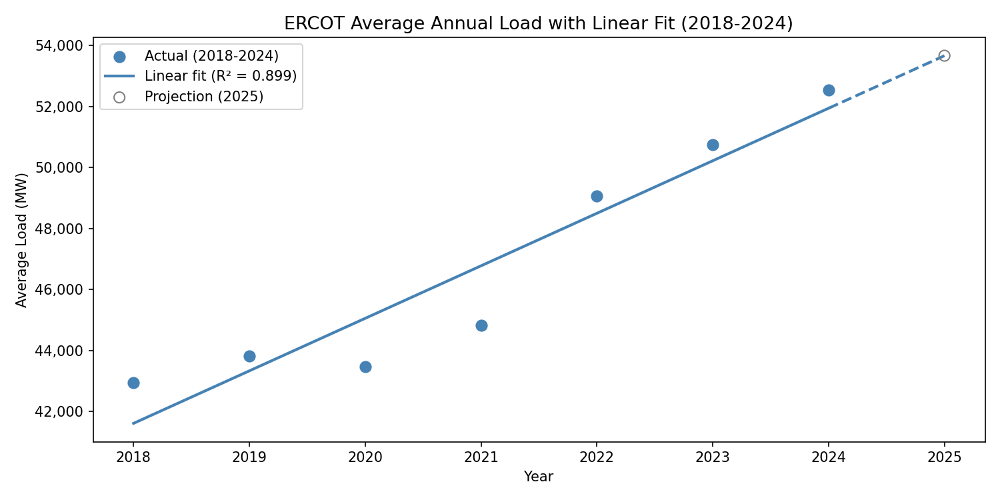
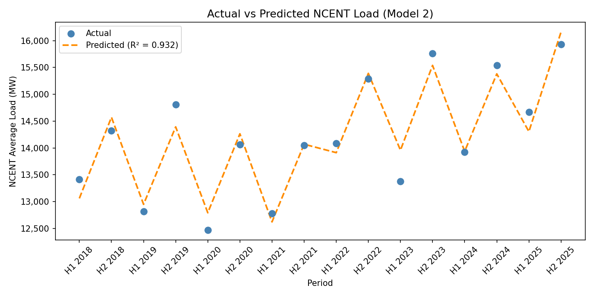

# ERCOT Texas Grid Load Analysis (2018-2024)

Analysis of 61,000+ hourly electricity load records across 8 ERCOT weather zones over 7 years, uncovering long-term demand trends, the statistical link between data center expansion and regional load growth, seasonal patterns, regional correlations, and grid vulnerabilities under extreme weather.

---

## Business Context

The Texas grid (ERCOT) is one of the largest and most stressed in the United States. Between accelerating data center construction, Winter Storm Uri (Feb 2021), and the summer-dominated load profile of the Gulf Coast, the grid faces simultaneous pressure on capacity planning, risk management, and dispatch coordination.

This project translates 7 years of public ERCOT operational data into six quantitative findings that directly inform three business decisions:

- **Capacity procurement** — how much generation to contract for, and when
- **Dispatch strategy** — when and where the grid will be most stressed
- **Risk management** — how to size reserves against extreme-weather scenarios

---

## Data

**ERCOT Hourly Load**

- Source: [ERCOT Hourly Load Data Archives](https://www.ercot.com/gridinfo/load/load_hist)
- Scope: 2018–2024, 8 weather zones + statewide total
- Volume: 61,000+ hourly records across 7 annual Excel files

**DFW Data Center Inventory (for Multiple Regression)**

- Source: CBRE Research — North America Data Center Trends
  ([latest report](https://www.cbre.com/insights/books/north-america-data-center-trends-h2-2025))
- Scope: H1 2018 – H2 2025, Dallas-Ft. Worth market
- Volume: 16 semi-annual observations
- ERCOT hourly load was extended through 2025 to match the inventory coverage period for regression analysis
- Inventory figures were anchored on CBRE-reported totals and chain-linked with semi-annual new delivery volumes from CBRE's historical market charts; all values were cross-validated against multiple reporting periods

---

## Methodology

1. **Schema normalization** — Column naming convention changed across years (`HourEnding` in 2018-2020 vs `Hour Ending` with a space in 2021-2024); normalized before concatenation.
2. **Time-series feature engineering** — Parsed timestamps and derived year, month, hour fields for grouping.
3. **Six analytical views** — Yearly growth, hourly profile, regional share, extreme-weather impact, inter-zonal correlation, seasonal comparison.
4. **Trend modeling** — Linear regression on annual averages to quantify long-term growth; multiple regression on semi-annual NCENT load to test the statistical significance of DFW data center capacity as a demand predictor, controlling for time trend, seasonality, and post-2022 structural break.
5. **Visualization** — matplotlib charts saved as PNGs under `outputs/` for reporting.

---

## Interactive Dashboard

### Overview (Preview)


### Deep Dive (Preview)


For full interactivity and detailed views, explore the [live dashboard](https://app.powerbi.com/view?r=eyJrIjoiNWRmNGI2ODktODMwMS00ZGUwLWFhMWEtNDI3NzZhNTRhMzJkIiwidCI6IjQ5MDgyZTYzLWM4NzEtNGMwZS1hNmNiLWRmODBmNTVmOGIyNSJ9).

---

## Key Findings

### 1. Post-2022 Demand Growth Acceleration

Statewide ERCOT demand grew **22.3%** from 2018 to 2024. Post-2022 annual growth averaged **5.47%**, roughly **3.8x** the pre-2022 baseline of **1.45%**. This structural shift aligns with the wave of large-scale data center openings in Texas (Meta/Fort Worth 2022, Amazon/Dallas 2022, Microsoft 2023, xAI 2024).


A linear regression on the annual average load puts the long-term growth at
about 1,700 MW per year (R² = 0.90, p = 0.001), projecting the 2025
statewide average at 53,665 MW.



To investigate whether data center expansion is a statistically significant
driver, I built a multiple regression on semi-annual NCENT zone load using
time trend, seasonality, a post-2022 structural break, and DFW data center
inventory (MW) as predictors. Adding data center capacity improved the model
(R² = 0.888 → 0.932); the data center coefficient is significant
(β = 2.08, p = 0.022), indicating each additional MW of data center capacity
is associated with approximately 2 MW of additional regional grid load.



> **Strategic implication:** Post-2022 growth should be modeled as the new demand baseline for long-term capacity planning.

### 2. Houston Daily Load Profile

Houston (COAST) load peaks at **16:00** (14,951 MW) and bottoms at **3:00 AM** (10,854 MW) — a **37.7% peak-to-trough swing**.

> **Strategic implication:** Defines the daily peaker-plant dispatch window and the scale of demand-response flexibility needed.


### 3. Regional Load Concentration

NCENT (Dallas-Fort Worth) and COAST (Houston) together account for nearly 58% of statewide load (30.0% and 27.9% respectively).

> **Strategic implication:** Reliability investment and grid-hardening priorities should concentrate on these two zones.


### 4. Winter Storm Uri — Empirical Risk Benchmark

During Feb 2021, Houston demand surged **41.8% above the normal February baseline** (15,692 MW peak vs. 11,070 MW normal), then **collapsed to 7,804 MW** as the grid failed.

> **Strategic implication:** Quantitative benchmark for sizing winter reserve margins and evaluating weatherization ROI.


### 5. Houston-Dallas Peak Synchronization

The two largest zones are highly correlated (**r = 0.859**) with peaks just **one hour apart** (16:00 Houston, 17:00 Dallas).

> **Strategic implication:** Grid stress compounds during a narrow 16:00-17:00 window statewide, a structural constraint on dispatch flexibility and reserve allocation.


### 6. Seasonal Peak Shift

Summer peak occurs at **15:00 (19,151 MW)** while winter peak shifts to **18:00 (12,001 MW)** — a **7,150 MW seasonal gap (59.6%)** and a 3-hour timing shift.

> **Strategic implication:** Procurement contracts and dispatch models must be reconfigured seasonally, not held constant year-round.


---

## Strategic Recommendations

| Business Decision                | Data-Backed Recommendation                                                                     |
| -------------------------------- | ---------------------------------------------------------------------------------------------- |
| **Long-term capacity planning**  | Model post-2022 demand growth (5.47% annual avg) as the forward-looking planning baseline      |
| **Winter reserve sizing**        | Size against Uri-era stress: +41.8% surge headroom plus supply-side weatherization             |
| **Summer peak dispatch**         | Stage peaker generation for 15:00-17:00 window statewide (Houston + Dallas compound)           |
| **Seasonal contract structure**  | Split procurement into summer-afternoon vs winter-evening blocks with distinct volume profiles |
| **Regional investment priority** | Focus reliability upgrades on COAST and NCENT zones (majority of statewide load)               |

---

## Tech Stack

- **Python 3** — Pandas, NumPy
- **scikit-learn** — Linear Regression
- **statsmodels** — Multiple Regression (OLS), VIF diagnostics
- **Matplotlib** — visualization
- **Power BI** — interactive dashboard with Power Query, DAX measures, and cross-filtering

---

## Repository Structure

```
ercot-texas-power-grid-analysis/
├── data/                                 # Not tracked in Git
│   ├── Native_Load_2018.xlsx
│   ├── ...
│   ├── Native_Load_2024.xlsx
│   └── datacenter/
│       ├── Native_Load_2025.xlsx
│       └── dfw_datacenter_inventory.csv
├── outputs/                              # Generated charts
│   ├── ercot_linear_trend.png
│   ├── ercot_yearly_trend.png
│   ├── ercot_zone_share.png
│   ├── houston_hourly_pattern.png
│   ├── ncent_multiple_regression.png
│   ├── seasonal_pattern.png
│   ├── uri_analysis.png
│   └── zone_correlation.png
├── ercot_power_grid_analysis.ipynb       # Main notebook
├── powerbi_dashboard_overview.png        # Dashboard preview
├── powerbi_dashboard_deepdive.png        # Dashboard preview
├── requirements.txt
├── .gitignore
└── README.md
```

Note: Data files are not included in this repository. See the Data section above for sources and download links.
